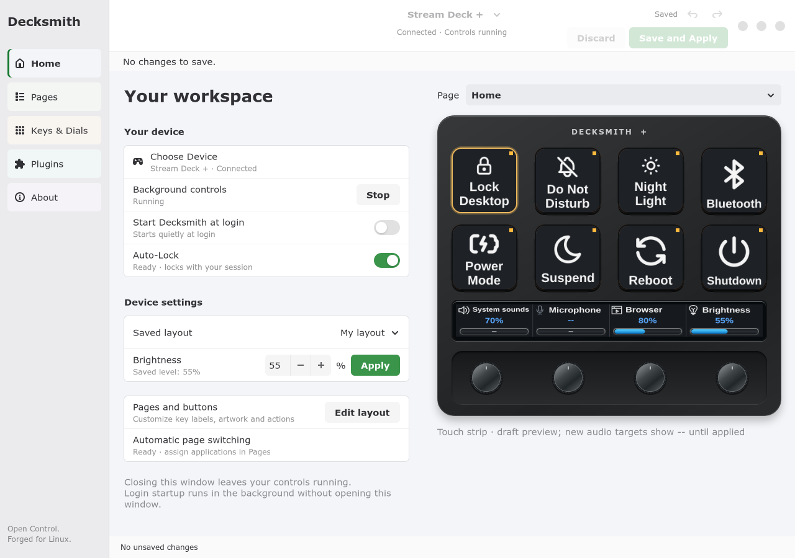
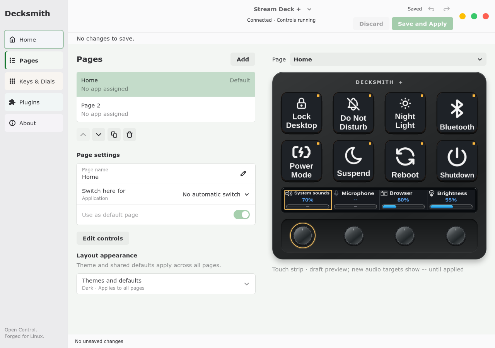
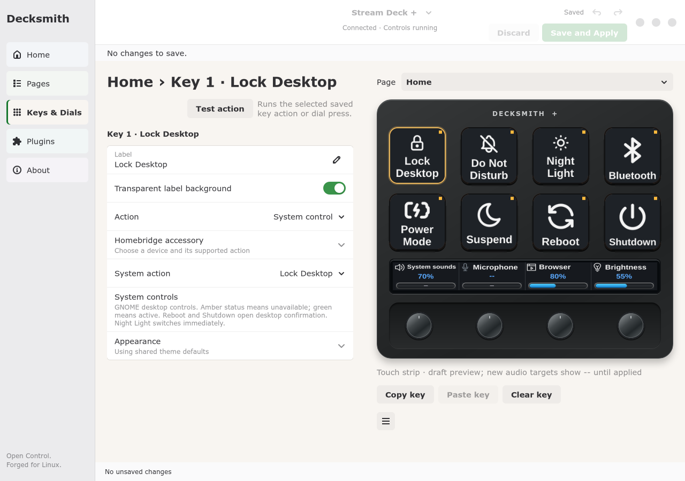
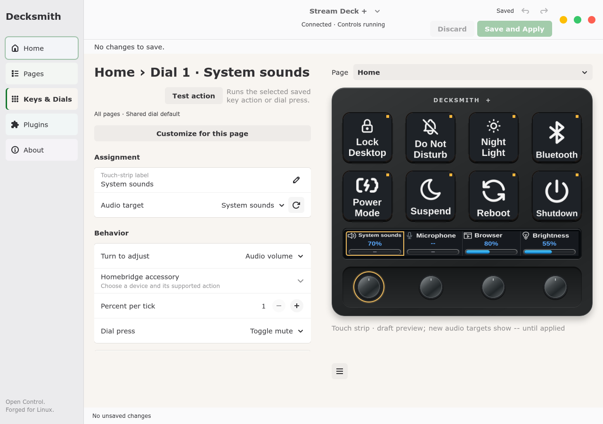

# Decksmith

> **Open Control, Forged for Linux.**

> A polished, Linux-native control application for Elgato Stream Deck hardware, with the Stream Deck + as the reference device.

**Status:** `v0.1.0-preview.1` — early preview for testing and feedback, not V1.

[Download the preview](https://github.com/infamous-pattern/decksmith/releases/tag/v0.1.0-preview.1) · [Installation and dependencies](docs/installation.md) · [Reviewer guide and known limits](docs/preview-release.md) · [Report an issue](https://github.com/infamous-pattern/decksmith/issues)

**Reference platform:** Fedora Workstation 44, GNOME, Wayland  
**Reference hardware:** Elgato Stream Deck +  
**Languages:** Currently English-only. Support for English, German, French, Spanish and Italian is planned for a future release.<br>
**License:** Apache-2.0 for original project code; see [LICENSE](LICENSE).

## Interface preview

The current native GTK4/libadwaita interface follows your GNOME light or dark
appearance. These screenshots show the development build with a demonstration
layout; device artwork and control assignments are customizable. Every tab keeps
its controls on the left and the device preview on the right.

The editor includes 14 bundled font choices: Sans, Serif, Monospace, Roboto,
Open Sans, Lato, Montserrat, Oswald, Raleway, Poppins, Nunito, Merriweather,
Source Sans 3, and Viking Runes (decorative). The rune option converts letters
for display while preserving the original label text. Fonts work offline and
use the same renderer for the preview and physical device.
[Font sources and licenses](assets/fonts/README.md).

When launched with background controls stopped, Decksmith offers to start them
or continue without them. **Quit Decksmith**, **Stop Background controls**, and
normal system shutdown clear all keys and the touch strip. Closing only the
editor leaves background controls running.

**Home — device status, background controls, login startup and device settings.**



**Pages — organize pages, assign automatic switching and edit shared appearance.**



**Keys — assign actions, edit labels and customize artwork in the same window.**



**Dials — choose audio targets, rotation and press behavior, and touch-strip styling.**



[View the About page](docs/images/decksmith-about.png). The **Plugins** tab is a
roadmap page when the experimental integration is not installed; general plugin
support targets **V1.5**. With the managed
[OpenHomeB companion](docs/openhomeb-runtime.md), it provides inline Homebridge
connection settings and follows Decksmith startup and shutdown. The screenshot
uses demonstration connection data. Capability-based accessory assignment is available in Keys & Dials; general
plugin installation and marketplace browsing remain planned.
[View the Plugins page](docs/images/decksmith-plugins.png).

The experimental Homebridge integration supports inline server/account setup in
**Plugins → Connection setup**. Password storage requires GNOME Keyring (Secret
Service) and `secret-tool`, supplied by Fedora’s `libsecret` package. Two-factor
codes are not saved; a new code may be needed after restart or session expiry.
See [Homebridge setup and recovery](docs/openhomeb-runtime.md).

## Requirements and dependencies

The current development bundle targets **Fedora Workstation 44, x86_64, GNOME on
Wayland**, with **Stream Deck +** as the validated physical device. This is not yet
an RPM or a signed V1 release. Other distributions, desktops, architectures and
Stream Deck models need their own validation. Independent control of multiple
devices is still planned.

### Running a prebuilt bundle

A Rust compiler is **not required** to run a prebuilt bundle. The bundle includes
Decksmith's binaries, Python source, bundled icons, fonts and documentation; the
following system libraries and tools must already be installed:

| Fedora packages | Used for |
|---|---|
| `python3`, `python3-gobject` | Native editor and integration helpers; Python access to GTK and D-Bus through GObject introspection. |
| `gtk4`, `libadwaita` | GNOME interface widgets. The runtime check verifies the required `Gtk.FileDialog` and `Adw.Dialog` APIs. |
| `python3-pillow`, `python3-cairo`, `librsvg2` | Artwork decoding, resizing and SVG icon rendering. |
| `glib2` | GIO/D-Bus integration and the `gdbus` utility. |
| `systemd`, `systemd-libs` | Per-user background service, login-session integration and `libudev` device discovery. |
| `pulseaudio-libs`, `pulseaudio-utils` | `libpulse` live audio meters and `pactl` application/device audio controls. |
| `wireplumber` | PipeWire session management and `wpctl` volume controls. |

Install these on Fedora with:

```sh
sudo dnf install python3 python3-gobject python3-pillow python3-cairo gtk4 libadwaita librsvg2 glib2 systemd systemd-libs pulseaudio-libs pulseaudio-utils wireplumber
```

Decksmith also needs a normal graphical user session with its session D-Bus and
working audio services. On Fedora Workstation, these normally include PipeWire,
`pipewire-pulseaudio` and WirePlumber. The PulseAudio client packages above work
with PipeWire's compatibility service; they do not require replacing PipeWire
with the PulseAudio server. Do not run Decksmith as root.

Physical device access requires a suitable **udev access rule**. Existing rules
from another controller may already provide access. The bundle includes
`packaging/udev/70-decksmith-plus.rules`; the per-user installer does not install
system-wide rules automatically. Close other Stream Deck controllers before
starting Decksmith's background controls. A connected device is not required to
install or run the VirtualDeck checks.

### Optional features and desktop services

| Feature | Additional requirement or limitation |
|---|---|
| GNOME panel menu and GNOME automatic page switching | The bundled Decksmith GNOME Shell extension, installed and enabled separately. See [desktop integration](docs/desktop-integration.md). Login startup itself does not require the extension. |
| Media playback actions | An application exposing MPRIS on the session D-Bus. Available actions depend on the player. |
| Lock, Do Not Disturb, Night Light and Bluetooth | The corresponding GNOME settings/services. Bluetooth also needs an available adapter; a hardware radio block cannot be overridden. |
| Power Mode | A service providing `net.hadess.PowerProfiles`, and profiles supported by the system. Unsupported profiles are shown as unavailable. |
| Suspend, Reboot and Shutdown | systemd-logind authorization and system support. Desktop inhibitors are respected; Reboot and Shutdown require confirmation. |
| Auto-Lock | Lock-state reporting from GNOME or systemd-logind. See [Auto-Lock](docs/auto-lock.md) for fallback behavior and desktop limitations. |
| Website artwork and URL actions | Network access for downloading website icons or opening remote sites. Core local controls need no cloud account or internet connection. |

No Elgato Windows/macOS software or OpenDeck installation is required. Missing
optional services can make individual actions unavailable even when installation
checks pass.

### Building from source

In addition to the runtime packages, install **Rust/Cargo, GCC, binutils,
`pkgconf-pkg-config` and `systemd-devel`** (libudev development headers):

```sh
sudo dnf install rust cargo gcc binutils pkgconf-pkg-config systemd-devel
python3 scripts/build-bundle.py
```

The workspace uses Rust edition 2024. Use a current toolchain compatible with the
locked dependencies. Cargo may need network access on the first build to fetch
those dependencies; no Rust toolchain is needed on machines receiving the bundle.

For installation, USB access, updates and rollback, follow the
[installation guide](docs/installation.md). After installation, check dependencies
and bundle integrity with:

```sh
python3 ~/.local/share/decksmith/app/current/scripts/runtime-doctor.py
```

Use your configured XDG data path if it differs. The checker reports missing
dependencies; it does not install packages or change device permissions.

## Product intent

Decksmith is intended to be a first-class Linux desktop application, not a cross-platform application that merely happens to run on Linux. The product should provide a professional configuration experience, a reliable background daemon, deep Linux integrations, and optional compatibility with the open/unprotected portion of the Stream Deck plugin ecosystem.

The following principles describe the product direction; some remain roadmap work.
See the [user guide](docs/USER_GUIDE.md) for current functionality.

Core principles:

- Linux first; Fedora is the reference distribution.
- GNOME/Wayland is a first-class target.
- Native GTK4/libadwaita UI.
- Rust for the daemon, device layer, Capability Engine, Context Engine, renderer, and most system integrations.
- SQLite for local configuration and state.
- Capability Engine for commands, adjustments, stateful controls, navigation, and dynamic providers.
- Profile -> Workspace -> Page hierarchy with Global/Profile/Workspace/Page binding scopes and temporary Context Layers.
- Customization-first renderer with panoramic key backgrounds, independent touch-strip backgrounds, themes, and per-control/state overrides.
- Behavior and appearance are independently portable/shareable.
- No cloud account, telemetry, or always-online dependency.
- Stream Deck + dials and touch strip are first-class capabilities.
- Deterministic Trigger Resolver supports short press, double press, long press, hold/repeat, raw press/release, dial-push gestures, and hardware touch gestures.
- VirtualDeck and hardware-in-loop testing are first-class engineering requirements.
- Session lock/idle behavior is explicit so programmable controls can be disabled, dimmed, or show an idle appearance safely.
- `decksmithd` can start with the graphical user session when **Start Decksmith at login** is enabled; Decksmith Studio remains closed until requested. Installation leaves startup off unless previously enabled.
- Quick access is always available while Decksmith is running: a native Decksmith GNOME panel indicator on the reference desktop and StatusNotifierItem integration on supporting desktops.
- Plugins are optional; core functionality must remain useful without them.
- Security boundaries and crash isolation are part of the product, not post-1.0 cleanup.

## Product naming

- **Decksmith** — project and product
- **Decksmith Studio** — GTK4/libadwaita configuration application
- **decksmithd** — background daemon
- **decksmithctl** — command-line interface
- **The Forge** — profile/theme/workflow creation area inside Decksmith Studio
- **Blueprints** — reusable profile/template packages
- **Decksmith Foundry** — future community catalog for plugins, themes, Blueprints, and related content
- **Tagline:** **Open Control, Forged for Linux.**

## Documentation

- [User guide](docs/USER_GUIDE.md)
- [Install, update, backup and rollback](docs/installation.md)
- [Latest project checkpoint — September 14, 2026](docs/checkpoints/2026-09-14.md)
- [Appearance presets and local icon library](docs/appearance-and-icons.md)
- [Remaining roadmap](docs/ROADMAP.md)
- [Localization foundation and V2 language plan](docs/localization.md)
- [Everyday control feedback](docs/control-feedback.md)
- [Audio controls](docs/audio-controls-foundation.md)
- [Media controls](docs/media-controls.md)

- [Product Requirements](docs/PRODUCT_REQUIREMENTS.md)
- [Technical Architecture](docs/TECHNICAL_ARCHITECTURE.md)
- [Repository and Release Strategy](docs/REPOSITORY_STRATEGY.md)
- [Architecture Decision Records](docs/adr/)

## Understanding audio volume controls

Decksmith's app-volume controls adjust an application's playback streams through
Fedora. They do **not** move volume sliders inside the application or website.
For example, adjusting **Brave** in Decksmith changes Brave's audio output, while
YouTube's volume slider stays where you set it.

For YouTube playing through Brave to a Schiit Magni, the audio passes through:

**YouTube volume → Brave app volume → Magni output volume**

Each stage affects the final listening volume. Decksmith's Brave target controls
matching Brave playback streams together, including other tabs; it does not
provide a separate YouTube-tab volume control. The touch-strip percentage shows
the selected audio target's level, not YouTube's slider position.

**System sounds** controls the saved volume and mute state for desktop event
sounds (such as GNOME alerts), independently of your named output devices and
application streams. It replaces the former System output target. Select your
named output, such as **Output · Schiit Magni**, to adjust overall listening volume.
System sounds remains adjustable while no alert is playing. It does not enable
notifications disabled by Do Not Disturb or GNOME sound settings, and apps that
play notifications through their own media streams need their own app control.
The ordinary Volume Up/Down/Mute key actions still control the default output.
This is event-sound control, not an additional master mixer stage.

For an explicitly assigned audio device, a small centered marker below its
touch-strip volume bar shows whether it is the current Linux default output or
input: **green** means current default, **gray** means not default, and **amber**
means the status is unknown. This is a default-device status marker, not an audio
activity meter.

The rounded fill shows live audio signal activity; the numerical percentage shows
configured volume. Activity is blue below 80, yellow from 80, orange from 90, and
red from 95 on the normalized signal scale—not the configured volume percentage.
See [Live audio meters](docs/audio-meters.md) for supported targets and limitations.

Microphone controls also support **push-to-talk** on keys and dial presses, with
Muted/Live feedback on the matching touch-strip section. Hold to unmute and release
to mute; a touch-strip tap remains a mute toggle.

Media keys and dial presses also offer a **Media player** selector: choose a
specific running app or keep Automatic. See the [media controls guide](docs/media-controls.md).

See the [audio controls guide](docs/audio-controls-foundation.md) for setup,
app discovery, mute controls, and device status indicators.

## Proposed repository layout

```text
.
├── apps/
│   ├── decksmith-studio/     # GTK4/libadwaita desktop app
│   ├── decksmith-daemon/           # systemd --user daemon
│   └── decksmith-cli/              # CLI for diagnostics and automation
├── crates/
│   ├── decksmith-core/                    # domain model, contexts, capability contracts
│   ├── decksmith-device/                  # Stream Deck device abstraction
│   ├── decksmith-render/                  # layered key/touch/customization rendering
│   ├── decksmith-store/                   # SQLite persistence and migrations
│   ├── decksmith-linux/                   # Linux-native integrations
│   ├── decksmith-ipc/                     # D-Bus interfaces and types
│   ├── decksmith-plugin-host/             # plugin lifecycle and compatibility host
│   └── decksmith-testkit/                 # mocks, fixtures, simulator helpers
├── extensions/
│   └── decksmith-gnome/             # Smart Profiles + GNOME panel indicator
├── packaging/
│   ├── fedora/                       # RPM spec and desktop integration
│   └── udev/                         # Stream Deck device access rules
├── plugins/
│   └── examples/                     # native/open plugin examples
├── tests/
│   ├── integration/
│   └── hardware-in-loop/
├── docs/
│   ├── adr/
│   ├── PRODUCT_REQUIREMENTS.md
│   ├── TECHNICAL_ARCHITECTURE.md
│   └── REPOSITORY_STRATEGY.md
├── scripts/
├── .github/                          # added when GitHub becomes canonical
├── Cargo.toml
├── deny.toml
├── rustfmt.toml
├── justfile
├── CONTRIBUTING.md
├── SECURITY.md
├── CODE_OF_CONDUCT.md
└── README.md
```

## External references

- Elgato Stream Deck +: https://www.elgato.com/us/en/p/stream-deck-plus
- Elgato Stream Deck downloads/software: https://www.elgato.com/us/en/s/downloads
- Elgato HID protocol: https://docs.elgato.com/streamdeck/hid/stream-deck-plus/
- Elgato Stream Deck SDK: https://docs.elgato.com/streamdeck/sdk/
- OpenDeck: https://github.com/nekename/OpenDeck
- Logitech MX Creative Console: https://www.logitech.com/en-us/shop/p/buy-mx-creative-console
- Loupedeck software: https://loupedeck.com/us/downloads/
- StreamController: https://github.com/StreamController/StreamController
- `elgato-streamdeck` Rust crate: https://docs.rs/elgato-streamdeck/latest/elgato_streamdeck/

## Trademarks

Elgato and Stream Deck are trademarks of Corsair Memory, Inc. Decksmith is an independent project and is not affiliated with, endorsed by, or sponsored by Elgato or Corsair.

## Support Decksmith

If you enjoy Decksmith, you can [buy me a coffee](https://buymeacoffee.com/infamouspattern).

<a href="https://buymeacoffee.com/infamouspattern"></a>
