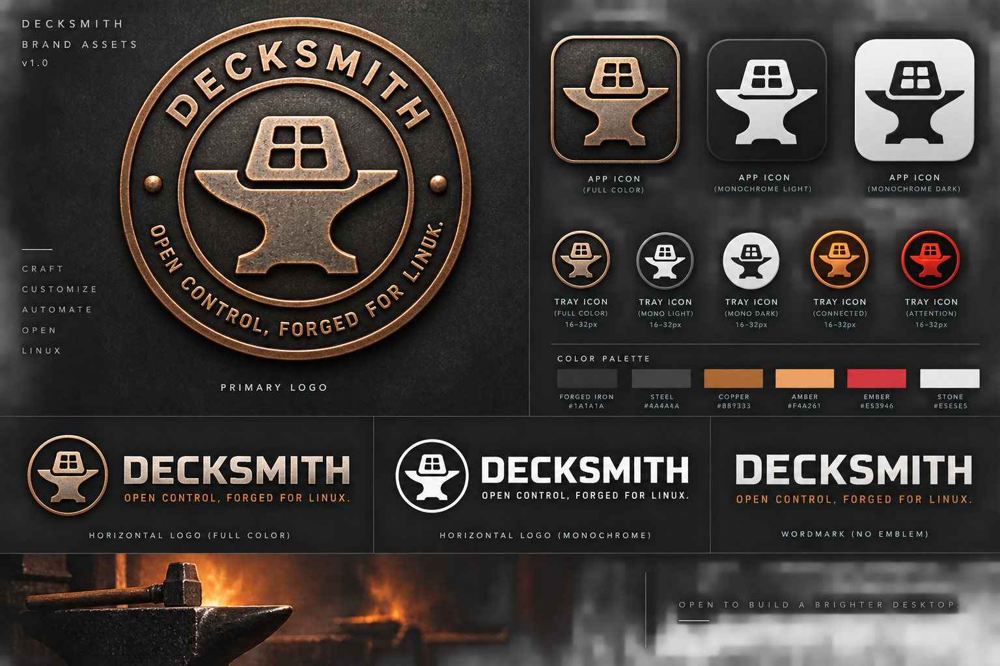

# Decksmith — Maker’s Mark

**Open Control, Forged for Linux.**

The user supplied the [shared brand sheet](https://chatgpt.com/s/m_6aa2e3a65ef481918b8412c86ab9ad34)
on 2026-09-10. The retrieved PNG is preserved unchanged, with its hash and dimensions
in provenance.json. The sheet itself is labeled Brand Assets v1.0; the project
documentation baseline remains v0.4.

It depicts the primary badge, full-color and monochrome app/tray treatments,
connected/attention treatments, horizontal logos, wordmark, and palette.
This is a single raster reference sheet, not individual transparent icons or SVGs.
Production icon exports and small-size legibility checks remain to be completed.
No replacement artwork has been generated.

The launcher uses `decksmith-app.svg`, a viewport onto the unchanged approved full-color app mark (the same artwork as About). The GNOME panel uses `extensions/decksmith-gnome/decksmith-symbolic.svg`, a small vector interpretation of the anvil and four-key mark, recolored by the desktop theme for legibility.
