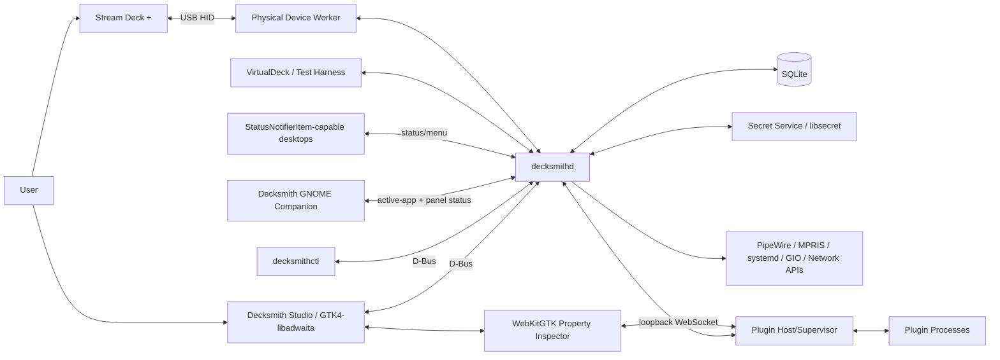
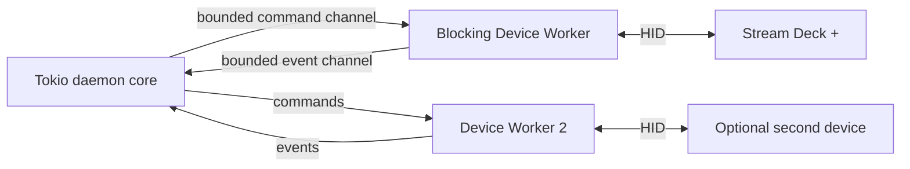
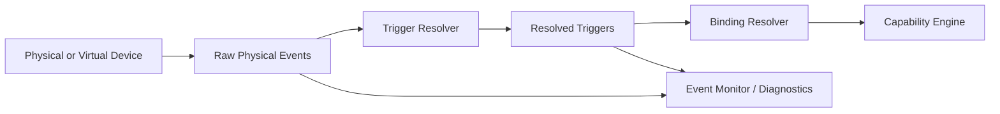
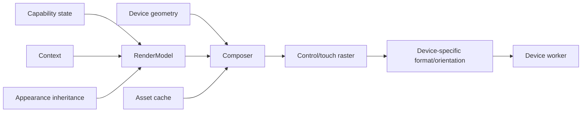
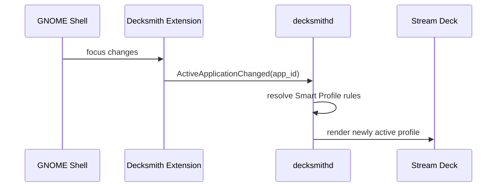
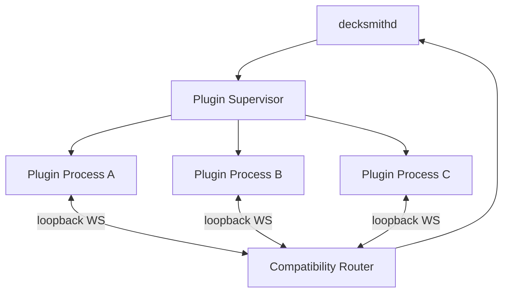

# Technical Architecture

**Project:** Decksmith   
**Architecture version:** 0.4  
**Status:** Architecture-frozen baseline for Phase 0  
**Reference platform:** Fedora Workstation 44, GNOME, Wayland  
**Reference hardware:** Elgato Stream Deck +

---

## 1. Architectural goals

The architecture must satisfy twelve primary goals:

1. **Device reliability is independent from GUI availability.**
2. **Linux-native integrations are first-class and do not depend on X11 emulation.**
3. **Third-party plugins cannot crash the core daemon.**
4. **The Stream Deck + touch strip and dials are modeled natively rather than bolted onto a key-only abstraction.**
5. **Persistence is local, transactional, migration-safe, and simple to administer.**
6. **The project can evolve from Fedora-first to broader Linux support without replacing its core domain model.**
7. **Capabilities are independent of control surfaces.** Commands, adjustments, stateful controls, navigation, and dynamic providers can be reused across compatible surfaces.
8. **Context and task hierarchy are explicit.** Profile -> Workspace -> Page plus temporary Context Layers are core domain concepts.
9. **Customization is architectural.** Behavior and appearance are separate, and the renderer supports panoramic backgrounds, themes, and per-control/state overrides without one-off hacks.
10. **Input semantics are deterministic.** Raw physical edges and higher-level gestures are separated by a Trigger Resolver with explicit timing/conflict rules.
11. **Virtual and physical devices share contracts.** A first-class VirtualDeck supports CI and development, while hardware-in-loop tests remain release gates for real HID behavior.
12. **Always-on runtime is separated from heavyweight UI.** `decksmithd` starts with the graphical session, while Decksmith Studio launches only on demand and desktop quick access is provided independently of the Studio process.

---

## 2. System context



The daemon is the operational center. The GTK configurator is a client. Hardware continues functioning if the configurator exits.

---

## 3. Process model

### 3.1 `decksmithd`

A user-session daemon managed by `systemd --user`.

Responsibilities:

- device discovery and lifecycle
- device worker coordination
- normalized raw input event stream and semantic Trigger Resolver
- rendering coordination
- active profile/page state
- capability execution
- D-Bus API
- persistence
- plugin supervision
- Linux integrations
- session lock/idle policy
- health and diagnostics

It must not require root.

### 3.2 Decksmith Studio (`decksmith-studio`)

A GTK4/libadwaita application.

Responsibilities:

- device/profile canvas
- drag-and-drop configuration
- capability/property/appearance editing
- plugin management UI
- icon/asset selection
- diagnostics UI
- onboarding
- import/export

The GUI never talks to HID devices directly.

### 3.3 `decksmithctl`

CLI for automation and troubleshooting.

Initial commands:

```text
decksmithctl devices
decksmithctl status
decksmithctl events [--raw|--resolved|--json]
decksmithctl emulate key <n> <press|release|short|double|long|hold>
decksmithctl emulate dial <n> <left|right|press|double|long> [value]
decksmithctl emulate touch <tap|long|flick-left|flick-right> [position]
decksmithctl profiles
decksmithctl profile activate <id-or-name>
decksmithctl page activate <n>
decksmithctl brightness <percent>
decksmithctl capability invoke <capability-instance-id>
decksmithctl diagnostics export <path>
```

### 3.4 Decksmith GNOME Shell companion

A deliberately small companion used for functionality GNOME Wayland does not expose to ordinary desktop applications and for a native Decksmith panel presence on the Fedora/GNOME reference desktop.

Responsibilities:

- detect active application changes
- optionally detect workspace changes
- emit sanitized application identity over D-Bus
- present the Decksmith panel icon and quick-access menu
- open/focus Decksmith Studio on request
- reflect daemon/device/paused/locked/attention state
- reserve an optional post-1.0 shell-surface hook for a cursor-centered Quick Palette without making it a 1.0 dependency

Non-responsibilities:

- HID
- capability execution
- profile persistence
- plugin hosting
- full configuration UI (the panel menu remains intentionally small)

Failure of the extension must degrade only Smart Profiles, not general device use.

### 3.5 Desktop indicator strategy

Decksmith must expose quick access without keeping Decksmith Studio resident. The daemon owns the runtime status model and quick-menu actions.

On GNOME, the Decksmith GNOME Shell companion renders the panel icon/menu directly and communicates with `decksmithd` over D-Bus. This avoids requiring a separate third-party tray extension on the Fedora reference platform.

On desktop environments that provide a StatusNotifierItem watcher, `decksmithd` exposes a StatusNotifierItem/DBusMenu-compatible status item. The daemon shall tolerate the absence of a watcher.

Minimum menu contract:

```text
Decksmith
├── Open Decksmith Studio
├── Device: <status>
├── Profile: <active profile>
├── Workspace: <active workspace>
├── Pause / Resume Controls
├── Preferences
├── Diagnostics
└── Stop Decksmith (advanced)
```

The indicator is optional from the user’s perspective, but enabled by default. Hiding it does not stop `decksmithd`.

### 3.6 Plugin processes

Each external plugin runs outside the daemon. A supervisor tracks:

- executable/runtime
- PID
- manifest identity
- capability instances
- WebSocket connection
- health/heartbeat where supported
- restart count
- last error

A plugin crash must never crash the daemon.

---

## 4. Rust workspace

```text
apps/
  decksmith-daemon/
  decksmith-studio/
  decksmith-cli/

crates/
  decksmith-core/
  decksmith-device/
  decksmith-render/
  decksmith-store/
  decksmith-linux/
  decksmith-ipc/
  decksmith-plugin-host/
  decksmith-testkit/
```

### 4.1 `decksmith-core`

Contains stable domain concepts only.

Examples:

```rust
DeviceId
DeviceKind
ControlAddress
ControlKind
ProfileId
WorkspaceId
PageId
FolderId
ContextLayerId
CapabilityDefinitionId
CapabilityInstanceId
ThemeId
AppearanceRuleId
PluginId
PhysicalInputEvent
ResolvedTrigger
CapabilityEvent
CapabilityResult
RenderState
```

No GTK, SQLite, hidapi, WebKit, or D-Bus implementation types should appear in the core public API.

### 4.2 `decksmith-device`

Responsibilities:

- adapter around `elgato-streamdeck` / HID layer
- device enumeration
- dedicated device workers
- normalized raw physical input events
- physical and virtual device implementations behind project-owned contracts
- key image writes
- touch-strip writes
- brightness
- reconnect/retry

Define a project-owned trait such as:

```rust
trait DeckDevice {
    fn descriptor(&self) -> DeviceDescriptor;
    fn write_key(&mut self, key: u8, image: &RenderedKey) -> Result<()>;
    fn write_strip(&mut self, region: StripRegion, image: &RenderedStrip) -> Result<()>;
    fn set_brightness(&mut self, percent: u8) -> Result<()>;
    fn next_event(&mut self) -> Result<DeviceInputEvent>;
}
```

The exact implementation can use the upstream crate, but other crates depend on `DeckDevice`, not on upstream types.

`VirtualDeck` implements the same project-owned device contract without HID. It must use real device geometry/capabilities and feed the same Trigger Resolver and renderer paths as a physical device.

### 4.3 `decksmith-render`

Responsibilities:

- device geometry and panoramic-canvas sampling
- text layout
- title rendering
- SVG/raster asset decoding and icon compositing
- key-grid background composition
- touch-strip background composition
- appearance inheritance and per-state overrides
- state overlays
- touch-strip widget rendering
- Control View rendering
- caching and dirty-region/coalescing support
- image format conversion
- size/orientation transforms by device kind

Tests should include golden-image fixtures for:

- empty state
- one-line title
- two-line title
- unicode
- long/clipped title
- progress widgets
- icons with transparency
- state toggles
- touch-strip layouts
- panoramic key backgrounds across physical gaps
- touch-strip full/segmented/hybrid backgrounds
- appearance inheritance and override precedence
- SVG recoloring/theme rendering
- Control Views
- plugin-provided layouts

### 4.4 `decksmith-store`

Owns:

- SQLite connection pool
- migrations
- repositories
- transactions
- backup/integrity utilities

No other crate should execute raw SQL.

Suggested Rust layer: SQLx with SQLite feature support.

### 4.5 `decksmith-linux`

Owns native Linux integrations behind capability traits:

- GIO / desktop entries
- PipeWire/WirePlumber
- MPRIS via D-Bus
- systemd via D-Bus
- Secret Service/libsecret
- NetworkManager
- BlueZ (optional)
- notifications
- input-injection helper client

### 4.6 `decksmith-ipc`

Owns versioned D-Bus interfaces and serializable DTOs shared by daemon/GUI/CLI.

### 4.7 `decksmith-plugin-host`

Owns:

- native plugin contract
- Stream Deck SDK compatibility adapter
- manifest parsing
- process supervision
- WebSocket host
- property-inspector sessions
- plugin capability policy
- plugin logs

### 4.8 `decksmith-testkit`

Provides:

- first-class VirtualDeck instances and mock device faults
- multi-device simulation
- scripted raw HID/input event streams and semantic trigger fixtures
- fake PipeWire/MPRIS/systemd backends
- temporary SQLite fixture
- fake plugins
- golden rendering helpers

This crate is important because most contributors will not own every Stream Deck model.

---

## 5. Concurrency and device I/O

The selected Stream Deck Rust library performs blocking work in parts of its async layer. The project should therefore treat HID access as an isolated blocking subsystem.

Recommended model:



Rules:

- one worker owns one HID handle
- no HID calls on GTK main thread
- no HID blocking work on latency-sensitive async executor threads
- bounded channels prevent unbounded memory growth
- renderer coalesces stale display updates
- rapid dial events may be aggregated only where the capability semantics permit it

VirtualDeck instances do not require blocking workers, but they publish commands/events through the same logical device-manager interfaces. Tests may create many VirtualDecks to exercise multi-device routing without USB hardware.

For FR-DEVICE-007, commands, input events, pending work and renderer caches must be
scoped by device ID and connection generation. Active profile/workspace/page and
brightness belong to the selected device session; a disconnect or worker failure
must not reset another device. Studio's device selection is an editing context,
not a global active-device switch. Device assignments persist independently of
connection presence, including when several devices intentionally share a profile.

---

## 6. Device abstraction

### 6.1 Device descriptor

```text
id
vendor_id
product_id
serial
model
firmware
key_rows
key_columns
key_pixel_width
key_pixel_height
dial_count
strip_width
strip_height
capabilities
```

`id` is a persistent application identity for one physical unit, not its current
HID node or enumeration index. Resolve it using a reliable hardware identity
(vendor/product/model and serial where available). Missing or duplicated serials
require an explicit association flow; do not silently transfer a saved assignment
based on discovery order. Friendly names and connection status help users select
identical models. Reconnect attaches a new session generation to the same persistent
identity and restores its assignment/preferences; ambiguous units remain unassigned
until resolved. See FR-DEVICE-007 for multi-device acceptance criteria.

### 6.2 Control addressing

Do not encode controls only as row/column.

Use a normalized address:

```text
Key { row, column }
Dial { index }
TouchRegion { index }
DeviceGesture { kind }
```

This allows future support for pedals, unusual device layouts, or + XL models without distorting the schema.

---

## 7. Input event and Trigger Resolver model

The architecture separates **physical input events** from **resolved semantic triggers**. This prevents device/HID details and gesture timing from leaking into capability implementations.

### 7.1 Raw physical events

```rust
enum PhysicalInputKind {
    KeyDown,
    KeyUp,
    DialRotate { ticks: i16 },
    DialDown,
    DialUp,
    TouchTap { position: Option<u16> },
    TouchLongPress { position: Option<u16> },
    TouchFlick { direction: FlickDirection },
    DeviceConnected,
    DeviceDisconnected,
}
```

Raw events always carry a monotonic timestamp and the physical control address. They are visible to diagnostics and advanced raw-edge bindings.

### 7.2 Semantic triggers

The Trigger Resolver consumes raw events and emits higher-level triggers:

```rust
enum TriggerKind {
    ShortPress,
    DoublePress,
    LongPress,
    HoldRepeat { ordinal: u32 },
    RawPress,
    RawRelease,
    Rotate { ticks: i16 },
    TouchTap,
    TouchLongPress,
    TouchFlick { direction: FlickDirection },
}
```

The same press-family semantics apply to key presses and dial pushes where the hardware exposes down/up edges. Touch supports only gestures actually provided by the device protocol; do not synthesize continuous drag behavior from insufficient data.

### 7.3 Trigger timing policy

Timing must use a monotonic clock. Recommended initial defaults (subject to usability testing):

```text
long_press_threshold   500 ms
double_press_window    300 ms
hold_repeat_delay      600 ms
hold_repeat_interval   100 ms
```

Defaults are configurable globally. Per-binding timing overrides are advanced settings and should be used sparingly.

### 7.4 Deterministic conflict rules

1. If no double-press binding exists, a completed short press may fire promptly on release.
2. If a double-press binding exists, the first short press is deferred until the double-press window expires.
3. If a valid second press completes inside that window, emit `DoublePress` and suppress the deferred `ShortPress`.
4. When the long-press threshold is crossed while still held, emit `LongPress` and suppress short/double for that sequence.
5. `HoldRepeat` begins only after the configured hold/repeat delay and stops immediately on release.
6. Raw `Press`/`Release` bindings are edge-triggered and are independent of gesture recognition; the UI warns about combinations that can intentionally execute both an edge action and a later gesture action.
7. Release after a long/hold gesture completes the physical sequence but does not retroactively emit short press.

### 7.5 Event metadata

Every physical event and resolved trigger carries enough context for diagnostics/replay:

```text
device_id
control_address
timestamp_monotonic
physical_sequence_id
profile_id
workspace_id
page_id
binding_id (if resolved)
capability_instance_id (if resolved)
raw_metadata (diagnostic only)
```

A sequence identifier lets diagnostics explain exactly which raw edge sequence produced a short/double/long/repeat trigger.

### 7.6 Trigger Resolver placement



Capabilities should normally consume resolved triggers rather than implementing their own timing logic. Low-level raw-edge behavior is reserved for explicit advanced bindings such as push-to-talk.

---

## 8. Capability and context architecture

### 8.1 Capability definition and instance

A **Capability Definition** describes reusable behavior independent of where it is placed.

Example:

```text
io.decksmith.audio.volume
```

A **Capability Instance** is one configured use of that definition.

```json
{
  "definition": "io.decksmith.audio.volume",
  "settings": {
    "target": "application:firefox",
    "step": 0.05
  }
}
```

A single definition can be expressed through multiple compatible surfaces: key, dial, touch region, Control View, workflow step, CLI, or future Quick Palette.

### 8.2 Capability taxonomy

Core categories:

```text
Command         discrete invocation
Adjustment      bidirectional/ranged value with optional live subscription
Stateful        N-state control, not limited to Boolean toggles
Navigation      profile/workspace/page/context navigation
DynamicProvider enumerates live capabilities/entities
```

The taxonomy is descriptive rather than a rigid inheritance tree; a capability may implement more than one interface where useful.

### 8.3 Capability contract

Conceptual interface:

```rust
trait CapabilityHandler {
    fn descriptor(&self) -> &CapabilityDescriptor;
    async fn handle(&self, ctx: CapabilityContext, event: CapabilityEvent) -> CapabilityResult;
    async fn state(&self, ctx: StateContext) -> CapabilityState;
    async fn render(&self, ctx: RenderContext) -> RenderModel;
}
```

Optional interfaces may add:

```text
adjust(delta/value)
subscribe_state()
enumerate_children()
control_view()
settings_schema()
```

`RenderModel` remains device-independent. `decksmith-render` converts it into device pixels.

### 8.4 Surface compatibility

Capabilities declare supported event/output surfaces:

```text
raw_press
raw_release
short_press
double_press
long_press
hold_repeat
dial_rotate
dial_short_push
dial_double_push
dial_long_push
touch_tap
touch_long_press
touch_flick
workflow_step
state_feedback
control_view
quick_palette (reserved, post-1.0)
```

The GUI only permits valid placements and ranks search results according to the selected surface.

### 8.5 Context Engine

The Context Engine resolves effective behavior from:

```text
active application
active profile
active workspace
active page
active folder/navigation location
active temporary Context Layer(s)
system/provider state
```

A temporary Context Layer may override compatible bindings without modifying the underlying page. This is especially useful for Stream Deck + dial/touch workflows such as temporarily changing four dials from normal system controls to color-editing parameters.

Resolution order must be deterministic and auditable.

### 8.6 Binding scopes

Bindings may be scoped as:

```text
Global
Profile
Workspace
Page
```

Higher-scope bindings persist while navigating lower scopes unless explicitly shadowed by a valid higher-precedence context rule.

### 8.7 Workspaces and Home Workspace

Profiles contain task-oriented Workspaces; Workspaces contain Pages. Every profile designates a Home Workspace so navigation always has a predictable recovery target.

### 8.8 Control Views

A Control View is a temporary, capability-driven rich surface. It can remap keys/dials/touch feedback to inspect or adjust one capability without changing the saved page.

Examples:

- volume with value, mute, output selection, and fine/coarse steps
- DaVinci exposure/contrast/saturation controls
- thermostat with target/current temperature and mode

Control Views are generated from project-native capability metadata/render models.

### 8.9 Dynamic providers

Dynamic providers enumerate live resources and expose them as capabilities. Examples include PipeWire streams, Home Assistant entities, OBS scenes, Proxmox guests, or Docker containers.

Providers must expose stable entity identity, lifecycle/state, metadata, and disappearance semantics so bindings can enter a recoverable "resource unavailable" state rather than silently breaking.

### 8.10 Workflows / Multi Actions

Represented as ordered child steps, not as an opaque JSON macro.

Each step includes:

```text
position
capability instance/template reference
delay_before_ms
failure_policy
optional_condition (architecture-ready)
```

The executor provides cancellation and emits step-level diagnostics. Conditional branching can mature after the reliable linear engine.

---

## 9. Rendering and customization architecture

### 9.1 Design rule: behavior and appearance are independent

The persisted functional binding answers **what a control does**. Appearance answers **how it is rendered**. A theme swap, panoramic background, icon pack, or state style must never mutate behavior mappings.

### 9.2 Device geometry

The renderer owns a `DeviceGeometry` description rather than assuming adjacent rectangles:

```text
key_rows
key_columns
key_pixel_width
key_pixel_height
horizontal_gap
vertical_gap
physical/virtual canvas bounds
touch_width
touch_height
dial positions/count
```

This allows one panoramic artwork canvas to be sampled correctly for separate physical key displays while accounting for the visible gaps between keys.

### 9.3 Appearance scope and inheritance

Strict precedence:

```text
Theme
  -> Profile
    -> Workspace
      -> Page
        -> Control
          -> State
```

Each layer may inherit, override, or reset selected appearance properties. The UI must clearly show whether a property is inherited or explicitly overridden.

### 9.4 Layered composition

Conceptual stack for a control:

```text
Deck/Touch Background Canvas
  -> Control Background Override
    -> State Overlay
      -> Icon/Artwork
        -> Label/Value
          -> Status/Badge/Progress
```

This stack produces a device-independent `RenderModel` before device conversion.

### 9.5 Panoramic key-grid backgrounds

For Stream Deck +, a user may assign one visual canvas spanning the full 2x4 key layout. The renderer samples the correct region into eight individual key images using `DeviceGeometry`; users never manually slice artwork.

The background source can be independently scoped at Theme/Profile/Workspace/Page levels, with per-control/per-state overrides on top.

### 9.6 Touch-strip backgrounds

Model the touch strip as a full logical canvas with optional regions. For Stream Deck +:

- logical width from device capability (nominally 800 px in the documented protocol)
- logical height from device capability (nominally 100 px)
- separate full-width background from the key-grid canvas
- full-width, segmented, and hybrid display modes
- four default encoder regions
- full-strip custom layouts
- dirty-region tracking for partial updates

Hybrid mode allows a shared panoramic background with semi-transparent/dynamic control widgets layered over it.

### 9.7 Asset model

Prefer SVG for scalable icons and theme artwork that benefits from recoloring/resolution independence. Also accept PNG, JPEG, and WebP.

Assets are content-addressed and stored on disk under XDG data paths. SQLite stores metadata/hash references, not large image blobs.

Common configurable image transforms:

```text
fit: cover / contain / stretch / original
position_x / position_y
scale
opacity
brightness/legibility overlay
optional tint/recolor for compatible SVG assets
```

### 9.8 Production render pipeline



The GTK virtual-device preview uses the same render model/composition rules as the hardware path. It may render at a different scale, but it must not maintain a separate visual interpretation.

### 9.9 Control Views

Control Views use the same rendering primitives and theme system. They may temporarily repurpose key/touch/dial surfaces without rewriting persistent page appearance.

### 9.10 Render cache and update scheduler

Cache key should include:

```text
device_kind/geometry
control_size
capability_instance
capability_state_hash
context_hash
appearance_hash
asset_hashes
scale/font inputs
```

A scheduler coalesces stale updates so rapidly changing provider state or live appearance editing cannot create an unbounded device queue. Touch-strip dirty regions and unchanged key frames should not be resent unnecessarily.

### 9.11 Animation policy

V1 supports functional animation/state changes when useful (recording indicator, progress, busy state) but does not require continuous decorative animation across the whole key grid. Full animated themes may be added later only after USB bandwidth, power, latency, and CPU impact are measured.

---

## 10. SQLite data architecture

### 10.1 Database location

Use XDG paths:

```text
$XDG_DATA_HOME/decksmith/decksmith.db
```

Defaults to:

```text
~/.local/share/decksmith/decksmith.db
```

State/logs/cache should use appropriate XDG state/cache directories rather than placing everything in the data directory.

### 10.2 Core tables

#### `devices`

```text
id TEXT PRIMARY KEY
serial TEXT
identity_key TEXT UNIQUE
model TEXT NOT NULL
friendly_name TEXT
last_seen_at TEXT
preferred_brightness INTEGER
metadata_json TEXT
```

`identity_key` represents a resolved, reliable hardware identity; a raw serial is
not assumed universally present or unique. The persistent `id` remains the owner
of saved assignments when identity needs user-assisted association.

#### `profiles`

```text
id TEXT PRIMARY KEY
name TEXT NOT NULL
is_default INTEGER NOT NULL DEFAULT 0
sort_order INTEGER NOT NULL
created_at TEXT NOT NULL
updated_at TEXT NOT NULL
```

#### `workspaces`

```text
id TEXT PRIMARY KEY
profile_id TEXT NOT NULL REFERENCES profiles(id) ON DELETE CASCADE
name TEXT NOT NULL
is_home INTEGER NOT NULL DEFAULT 0
sort_order INTEGER NOT NULL
```

#### `pages`

```text
id TEXT PRIMARY KEY
workspace_id TEXT NOT NULL REFERENCES workspaces(id) ON DELETE CASCADE
name TEXT
sort_order INTEGER NOT NULL
```

#### `control_bindings`

```text
id TEXT PRIMARY KEY
scope_kind TEXT NOT NULL          -- global/profile/workspace/page
scope_id TEXT NULL                -- null only for global scope
parent_folder_id TEXT NULL REFERENCES folders(id) ON DELETE CASCADE
control_address_json TEXT NOT NULL
capability_instance_id TEXT NOT NULL REFERENCES capability_instances(id) ON DELETE CASCADE
created_at TEXT NOT NULL
updated_at TEXT NOT NULL
UNIQUE(scope_kind, scope_id, parent_folder_id, control_address_json)
```

`scope_id` is polymorphic by design; `decksmith-store` validates that it resolves to a profile, workspace, or page appropriate to `scope_kind`. Keeping the binding address independent of a mandatory `page_id` is necessary for Global/Profile/Workspace-scoped controls.

#### `folders`

```text
id TEXT PRIMARY KEY
name TEXT
parent_folder_id TEXT NULL REFERENCES folders(id)
```

Folder cycles must be rejected in application logic and ideally protected with validation during writes.

#### `capability_instances`

```text
id TEXT PRIMARY KEY
definition_id TEXT NOT NULL
provider_id TEXT NULL
plugin_id TEXT NULL
settings_json TEXT NOT NULL DEFAULT '{}'
state_cache_json TEXT NOT NULL DEFAULT '{}'
created_at TEXT NOT NULL
updated_at TEXT NOT NULL
```

SQLite's JSON functions may be used for targeted querying, but stable domain relationships should remain relational rather than being hidden entirely inside JSON.

#### `workflow_steps`

```text
id TEXT PRIMARY KEY
parent_capability_instance_id TEXT NOT NULL REFERENCES capability_instances(id) ON DELETE CASCADE
sort_order INTEGER NOT NULL
child_definition_id TEXT NOT NULL
settings_json TEXT NOT NULL DEFAULT '{}'
delay_before_ms INTEGER NOT NULL DEFAULT 0
failure_policy TEXT NOT NULL DEFAULT 'stop'
```

#### `context_layers`

```text
id TEXT PRIMARY KEY
profile_id TEXT NOT NULL REFERENCES profiles(id) ON DELETE CASCADE
workspace_id TEXT NULL REFERENCES workspaces(id) ON DELETE CASCADE
name TEXT NOT NULL
exit_policy_json TEXT NOT NULL DEFAULT '{}'
```

#### `context_bindings`

```text
id TEXT PRIMARY KEY
context_layer_id TEXT NOT NULL REFERENCES context_layers(id) ON DELETE CASCADE
control_address_json TEXT NOT NULL
capability_instance_id TEXT NOT NULL REFERENCES capability_instances(id) ON DELETE CASCADE
```

#### `themes`

```text
id TEXT PRIMARY KEY
name TEXT NOT NULL
builtin INTEGER NOT NULL DEFAULT 0
settings_json TEXT NOT NULL DEFAULT '{}'
created_at TEXT NOT NULL
updated_at TEXT NOT NULL
```

#### `appearance_rules`

```text
id TEXT PRIMARY KEY
scope_kind TEXT NOT NULL
scope_id TEXT NOT NULL
state_key TEXT NULL
theme_id TEXT NULL REFERENCES themes(id)
background_asset_id TEXT NULL REFERENCES assets(id)
settings_json TEXT NOT NULL DEFAULT '{}'
```

Appearance validation enforces the documented Theme -> Profile -> Workspace -> Page -> Control -> State precedence and prevents dangling scope references at the repository layer.

#### `smart_profile_rules`

```text
id TEXT PRIMARY KEY
profile_id TEXT NOT NULL REFERENCES profiles(id) ON DELETE CASCADE
app_id TEXT NOT NULL
match_kind TEXT NOT NULL
priority INTEGER NOT NULL DEFAULT 0
enabled INTEGER NOT NULL DEFAULT 1
```

#### `plugins`

```text
id TEXT PRIMARY KEY
uuid TEXT UNIQUE NOT NULL
name TEXT NOT NULL
version TEXT NOT NULL
origin TEXT NOT NULL
install_path TEXT NOT NULL
enabled INTEGER NOT NULL DEFAULT 1
compatibility_mode TEXT NOT NULL
manifest_json TEXT NOT NULL
last_error TEXT
```

#### `assets`

```text
id TEXT PRIMARY KEY
sha256 TEXT UNIQUE NOT NULL
mime_type TEXT NOT NULL
relative_path TEXT NOT NULL
asset_role TEXT
width INTEGER
height INTEGER
metadata_json TEXT NOT NULL DEFAULT '{}' 
```

### 10.3 SQLite policy

At connection initialization:

```sql
PRAGMA foreign_keys = ON;
PRAGMA journal_mode = WAL;
PRAGMA synchronous = NORMAL;
PRAGMA busy_timeout = 5000;
```

`FULL` synchronous may be considered for migration/backup operations.

### 10.4 Migrations

- migrations are immutable after release
- each release tests migration from every still-supported schema baseline
- backup database before destructive migrations
- run `PRAGMA integrity_check` if migration fails or abnormal shutdown is detected
- expose recovery instructions in GUI rather than silently resetting data

---

## 11. Secrets

SQLite must not become a secret vault.

Use Secret Service/libsecret for:

- API tokens
- Home Assistant long-lived tokens
- MQTT credentials
- HTTP Authorization values
- SSH passphrases if ever supported directly

SQLite stores only a logical secret reference, e.g.:

```text
secret_ref = "capability:<uuid>:http-auth"
```

Exports omit secret material.

---

## 12. D-Bus API

Use a versioned service/interface name. Final reverse-DNS namespace depends on the chosen project/domain.

Example placeholder:

```text
Bus name: <final application-id>.Controller
Object:   /<final/application/id>/Controller
Interface: <final application-id>.Controller1

The reverse-DNS application ID shall be finalized only after the public project namespace/domain is secured; do not claim a DNS namespace the project does not control.
```

### 12.1 Initial methods

```text
ListDevices() -> devices
GetDevice(id) -> device
ListProfiles() -> profiles
ActivateProfile(id)
ActivateWorkspace(profile_id, workspace_id)
ActivatePage(workspace_id, page_id)
SetBrightness(device_id, percent)
InvokeCapability(capability_instance_id)
GetStatus() -> status
ReloadConfiguration()
ExportDiagnostics(path)
```

### 12.2 Signals

```text
DeviceAdded
DeviceRemoved
DeviceChanged
ProfileActivated
PageActivated
ControlStateChanged
ContextChanged
WorkspaceActivated
AppearanceChanged
CapabilityStarted
CapabilityCompleted
CapabilityFailed
PluginStateChanged
```

### 12.3 GUI write operations

Configuration mutation can either be exposed as narrowly typed D-Bus methods or as a versioned transaction API. Do not allow the GUI to write the SQLite database directly; the daemon remains the single writer and authority.

That avoids cross-process write races and keeps validation in one place.

---

## 13. Smart Profiles and automatic page switching

### 13.1 Problem

GNOME Wayland intentionally does not provide arbitrary applications a global active-window inspection API comparable to legacy X11 approaches.

### 13.2 Design

A minimal GNOME Shell extension watches the active window/application and emits an event only when the application identity changes.



### 13.3 Data shared

Prefer application identity such as desktop-file ID or WM class equivalent. Do not send window title/content unless a future feature explicitly requires it.

### 13.4 Planned desktop adapters and page rules

The GNOME extension remains the reference implementation. The same daemon-owned
context rule engine shall accept application-identity changes from planned
Hyprland, Sway, Mangowm, KDE/kdotool, and X11 adapters. Detect available adapters
and dependencies; each claimed desktop requires verification. Rules may target
profile, workspace, or page. The September 16 GNOME page milestone uses one page
per application, immediate switching, chosen-default-page selection for unassigned apps, and
manual navigation until the next foreground app change. It has no pause control
or sticky manual override. Keep unsaved Studio drafts separate from runtime navigation.
Window-title/content matching is not implicitly authorized by these requirements.

Auto-Lock (FR-DAEMON-006/007) takes precedence over action dispatch and automatic
page switching. Use session lock reports from systemd-logind where available and
planned desktop adapters for Hyprland, GNOME, KDE, and Cinnamon. Reconcile lock
state on startup/reconnect; unknown state cannot clear an established lock.

Sticky actions use the existing Global/Profile/Workspace/Page binding scopes and
resolver, not copied per-page bindings. The editor must expose inheritance and
scope conflict handling; see FR-PROFILE-008 and the roadmap's reusable-actions task.

### 13.5 Failure mode

If the extension is unavailable:

- current profile stays active
- manual switching still works
- UI shows Smart Profiles unavailable with actionable installation/status help

---

## 14. Wayland keyboard/input capabilities

### 14.1 Constraint

X11 tools such as `xdotool` are not a reliable foundation for Fedora GNOME Wayland.

### 14.2 Proposed helper

Use a small private input helper that owns `/dev/uinput` access through a narrowly scoped local IPC channel controlled by the daemon.

Important security properties:

- not a public network service
- not directly exposed to plugin WebSockets
- input sequences are validated by daemon policy
- project udev/polkit rules are reviewed carefully
- helper logs metadata but never typed secret content

A future portal-based mechanism should be preferred if Linux desktops standardize a suitable trusted input API.

---

## 15. Linux native integrations

### 15.1 Audio

Prefer PipeWire/WirePlumber APIs over shelling out to `pactl`.

Capabilities:

- master/default sink volume
- source/microphone volume
- mute
- source/sink selection
- per-stream/application volume
- live level/state feedback where feasible

### 15.2 Media

MPRIS over D-Bus:

- play/pause
- stop
- next/previous
- seek where supported
- track title/artist/artwork metadata

### 15.3 Applications

Use desktop entries/GIO rather than hard-coded executable paths when launching installed GUI applications.

## 14A. Login startup and background lifetime

### 14A.1 Default behavior

`decksmithd` is the always-on user-session component. Decksmith Studio is not kept resident merely to control hardware.

Expected login flow:

```text
Graphical login
    ↓
systemd --user / graphical session
    ↓
decksmithd.service
    ├── restore SQLite state
    ├── register D-Bus API
    ├── publish indicator status
    ├── discover/watch HID devices
    └── operate without Studio

User selects Open Decksmith Studio
    ↓
decksmith-studio activates/focuses single GUI instance
```

On the Fedora/GNOME reference platform, packaging should prefer a user unit associated with `graphical-session.target`, following systemd desktop-integration conventions. If another desktop does not activate the required graphical target reliably, packaging may use an XDG-autostart compatibility launcher whose only purpose is to activate the user service rather than host the runtime itself.

A Preferences switch named **Start Decksmith at Login** controls this behavior and defaults to enabled.

### 14A.2 Resource behavior

When no compatible device is connected, the daemon remains event-driven and low-overhead, waiting for hot-plug and D-Bus/session events rather than polling aggressively.

### 14A.3 Studio activation

Decksmith Studio uses single-instance application activation. Requests from the panel/tray, CLI, desktop launcher, or another Studio invocation focus the existing primary window rather than creating duplicate configuration sessions.

### 15.4 systemd

Prefer D-Bus for service operations and status. Keep privileged system-service capabilities behind explicit authorization rather than assuming passwordless sudo.

### 15.5 HTTP/MQTT

Networking lives in the daemon/capability layer, with explicit timeouts and cancellation. Sensitive headers/credentials reference Secret Service entries.

---

## 16. Plugin architecture

### 16.1 Two plugin modes

```text
Native Decksmith plugin
Stream Deck SDK compatibility plugin
```

The native contract is optimized for Linux and can evolve deliberately.

The compatibility contract emulates documented Stream Deck host behavior only where useful and lawful.

September 17 planning update: OpenAction is the first compatibility target for
V1.5. Evaluate its protocol against the native contract during the next architecture
review, before freezing interfaces. The host adapter and a tested plugin subset
precede optional external catalog browsing. Preserve Decksmith's native settings
and execution boundaries; neither catalog membership nor SDK compatibility alone
establishes that a plugin works on Linux. See the [V1.5 delivery sequence](ROADMAP.md#plugin-support--v15-target).
This is planned architecture, not implemented plugin support.

### 16.2 Native provider contract

Native plugins/providers may expose:

```text
capability descriptors
dynamic entity enumeration
live state subscriptions
Control View descriptors
declarative settings schema
application/global/system scope metadata
```

The native settings schema is rendered by GTK using project-owned controls for consistency and accessibility. WebKitGTK remains reserved for compatibility Property Inspectors that require web content.

### 16.3 Plugin supervisor



### 16.4 Listener policy

Compatibility WebSocket/HTTP servers bind to:

```text
127.0.0.1 / ::1 only
```

Never `0.0.0.0` by default.

### 16.5 Property Inspectors

A plugin property inspector is web content. Host it in WebKitGTK with:

- separate web context where practical
- no direct access to daemon internals
- communication only through compatibility bridge
- restricted navigation
- controlled local-resource origin
- CSP where compatible

### 16.6 Runtime support

Priority order:

1. Linux-native executable plugins
2. Node.js plugins that are compatible with Linux
3. other open/unprotected plugin forms
4. Wine-hosted Windows plugins only as an optional best-effort feature

### 16.7 DRM-protected plugins

Current Elgato distribution supports DRM intended, among other things, to prevent unauthorized vendors from executing protected plugins. The project therefore must not make DRM-protected Marketplace compatibility a product requirement and must not attempt to bypass those protections.

---

## 17. Plugin capability/security model

Long term, plugins should declare capabilities such as:

```text
network
filesystem-read-selected
filesystem-write-selected
launch-process
notifications
audio-control
input-injection
secret-access:<named-secret>
```

The first implementation may not fully sandbox every plugin runtime, but the architecture must avoid granting plugins direct references to privileged helpers.

Potential Linux sandboxing mechanism: bubblewrap with per-plugin policy, introduced only after compatibility testing proves viable.

---

## 18. UI architecture

### 18.1 Toolkit

- GTK4
- libadwaita
- Rust bindings
- WebKitGTK only for plugin property-inspector web content

### 18.2 Window model

Recommended three-pane desktop layout:

```text
┌──────────────────────────────────────────────────────────────┐
│ Device / Profile header                                      │
├───────────────┬──────────────────────────┬───────────────────┤
│ Capability Lib│ Physical Device Canvas   │ Properties        │
│ + Search      │ keys / strip / dials     │ selected control  │
│               │                          │                   │
├───────────────┴──────────────────────────┴───────────────────┤
│ Page strip / status / optional contextual toolbar            │
└──────────────────────────────────────────────────────────────┘
```

### 18.3 Navigation model

The configurator exposes Profile -> Workspace -> Page explicitly. Higher-scope bindings remain visible or discoverable without pretending they belong to the current page. Home Workspace and temporary Context Layer state are always recoverable.

### 18.4 Capability catalog

The left catalog is searchable, type-aware, and provider-aware. It can show Commands, Adjustments, Stateful Controls, Navigation, Dynamic Providers, Workflows, and plugins. Empty controls can invoke the same catalog through an in-place Add flow.

### 18.5 Appearance editor

The properties area includes a dedicated Appearance mode capable of editing:

- panoramic deck background
- touch-strip background
- per-control background/icon/label
- theme inheritance and override state
- fit/position/scale/opacity
- state-specific appearance

Dragging an image onto the device canvas may offer context actions such as Entire Deck Background, Current Page Background, Selected Control Background, or Icon.

### 18.6 State ownership

The daemon owns canonical configuration. GUI maintains a local presentation model and submits mutations through D-Bus. Successful mutations return updated version/revision IDs.

### 18.7 Optimistic UI

For low-risk edits, GUI may update immediately and reconcile with daemon response. Failed validation rolls back with a clear inline error.

### 18.8 Undo/redo

Maintain a GUI command stack for user edits while writes remain transactional in the daemon. Each mutation can carry a client transaction identifier to support deterministic revert operations.

---

## 19. Import/export and shareable artifacts

Project-native packages are ZIP archives with versioned manifests and content-addressed assets. Behavior and appearance are independently portable.

Recommended artifact classes (final names/extensions TBD):

```text
Profile package    mappings + workspaces + pages + required assets/dependencies
Theme package      appearance/theme rules + visual assets only
Workflow package   reusable workflow definition + non-secret settings
Bundle             explicit combination of the above
```

A profile package may look like:

```text
manifest.json
behavior.json
appearance.json
assets/
  <sha256>.<ext>
```

Properties:

- versioned schema
- checksums
- no secrets by default
- deterministic references by asset hash
- import validation before DB transaction
- explicit missing-provider/plugin report
- future signature field supported but not required initially
- applying a theme never changes behavior mappings

---

## 20. Diagnostics

### 20.1 Logging

Use `tracing` with structured fields:

```text
device_id
plugin_id
capability_instance_id
profile_id
error_code
operation
latency_ms
```

Avoid logging:

- auth tokens
- HTTP Authorization headers
- secret values
- arbitrary clipboard contents

### 20.2 Journal integration

`decksmithd` logs to the user journal by default.

### 20.3 Diagnostics bundle

Include:

- application version/build ID
- Fedora/kernel/desktop session information
- device model/firmware (serial optionally redacted)
- database schema version
- enabled plugin metadata
- recent redacted logs
- udev access check
- PipeWire/WirePlumber status
- GNOME extension status

---

## 21. Testing architecture

### 21.1 Unit tests

- Trigger Resolver timing/conflict semantics
- context/binding-scope resolution
- appearance inheritance resolution
- profile resolution
- Smart Profile precedence
- SQLite repositories
- migration logic
- plugin manifest validation
- render-model transformations
- dynamic provider reconciliation

### 21.2 Golden rendering tests

Render known inputs and compare to approved image fixtures. Use tolerances only where font rasterization requires them. Required fixtures include panoramic key canvases, physical-gap sampling, per-state overrides, touch-strip hybrid layouts, SVG recoloring, Control Views, and inherited theme combinations.

### 21.3 Integration tests

Use fake implementations of:

- device backend
- MPRIS
- PipeWire
- systemd
- plugin WebSocket client

### 21.4 Hardware-in-loop tests

Run on the development desktop with the actual Stream Deck +.

Cases:

- rapid key presses
- short vs double press timing boundaries
- long-press suppression of short/double
- hold-repeat start/stop cadence and release behavior
- raw press/release combined with gesture bindings
- simultaneous dial activity
- dial short/double/long push gesture resolution
- unplug/replug loops
- suspend/resume
- daemon restart
- GUI restart while daemon runs
- plugin crash during active profile
- high-frequency strip updates
- live panoramic-background editing and repeated WYSIWYG preview
- appearance/theme swaps while capabilities continue running
- Context Layer enter/exit under rapid dial activity
- brightness changes
- desktop session lock/unlock and idle/active transitions
- locked-state execution suppression and appearance restoration
- corrupted/invalid plugin package

### 21.5 VirtualDeck and simulation

`VirtualDeck` is a first-class Phase 0 device implementation, not an optional late simulator. It must use real device geometry/capability descriptors and the production rendering, Trigger Resolver, binding, and Capability Engine paths.

The test harness shall support:

- one or many virtual Stream Deck + instances
- deterministic connect/disconnect/reconnect
- raw key/dial/touch event injection
- semantic trigger injection for higher-level UI tests
- rendered key/touch output inspection
- simulated device faults and delayed writes
- reproducible event scripts for regression tests

A GTK developer preview may expose VirtualDeck interactively, but automated tests must not depend on a graphical window.

---

## 22. Build and packaging

### 22.1 Local development

The primary development build runs directly on the full Fedora desktop machine so it can exercise:

- real HID
- GNOME Wayland
- PipeWire
- D-Bus
- systemd user services
- WebKitGTK
- actual Stream Deck + hardware

Repository hosting has no material effect on build speed once the source is cloned locally.

### 22.2 Developer toolchain

Recommended:

```text
Rust stable
cargo
just
cargo-nextest (optional but recommended)
cargo-deny
cargo-audit
gtk4-devel
libadwaita-devel
webkitgtk development package
libudev-devel
sqlite-devel
PipeWire/WirePlumber development packages as selected by API approach
```

### 22.3 One-command quality gate

`just check` should run:

```text
cargo fmt --check
cargo clippy --workspace --all-targets --all-features -- -D warnings
cargo test / cargo nextest
cargo deny check
selected integration tests
```

### 22.4 Fedora packaging

Reference package installs:

- daemon binary
- configurator binary
- CLI
- `.desktop` entry
- app metadata/icons
- D-Bus service/policy as needed
- systemd user unit with graphical-login activation
- Decksmith desktop file and application ID
- Decksmith GNOME panel companion metadata
- StatusNotifierItem integration on supporting desktops
- udev rules
- GNOME extension package/instructions

Native RPM is the reference packaging path. Flatpak is deferred.

---

## 23. CI/CD architecture

### 23.1 Hosting transition

During private incubation:

- Gitea may be the writable private origin.
- Gitea Actions can run host/container jobs through `act_runner`.

At public developer preview:

- GitHub becomes canonical for code, issues, pull requests, discussions, releases, and community workflow.
- Local Gitea becomes a pull mirror/backup.

### 23.2 Keep CI portable

CI files should call repository scripts/`just` recipes rather than embedding all build logic in host-specific workflow YAML.

Example:

```text
workflow -> just check
workflow -> just test-integration
workflow -> just package-rpm
```

This makes moving between Gitea Actions and GitHub Actions straightforward.

### 23.3 Release integrity

Public releases should eventually include:

- signed Git tags
- checksums
- signed RPM/repository metadata where applicable
- SBOM
- reproducible-build investigation
- dependency/license report

---

## 24. OpenDeck reuse boundary

OpenDeck is a valuable reference for:

- plugin host behavior
- Stream Deck SDK event compatibility
- real-world Linux packaging issues
- Wine failure modes
- property inspector lifecycle
- Stream Deck + rendering bugs and edge cases

However, the proposed project should not fork OpenDeck as its core because its cross-platform Tauri/Svelte architecture and existing product choices do not match the Linux-native GTK/daemon design goal.

OpenDeck is GPL-licensed. If this project chooses a permissive license such as Apache-2.0, implementation code should be written independently against public specifications and behavior, not copied from GPL source.

The `elgato-streamdeck` Rust library can be used behind the `decksmith-device` adapter, subject to its current license and dependency review.

---

## 25. Recommended license and contribution model

### Project code

**Recommended:** Apache License 2.0, subject to final review.

Reasons:

- permissive for Linux distributions and integrations
- explicit patent grant
- clear contributor expectations
- allows commercial use without creating a proprietary dependency for users

If strong copyleft is a deliberate project goal, GPL-3.0-or-later is also viable, but that should be an explicit governance decision rather than an accidental consequence of copying OpenDeck code.

### Contribution model

Recommended:

- Developer Certificate of Origin (DCO) sign-off
- no CLA initially
- CODE_OF_CONDUCT.md
- CONTRIBUTING.md
- SECURITY.md
- issue/PR templates
- Conventional Commits recommended, not necessarily enforced initially

---

## 26. Architecture decision records

Accepted in the baseline documentation set:

- ADR-0001: SQLite as local persistence
- ADR-0002: GTK4/libadwaita native UI and daemon split
- ADR-0003: Gitea incubation, GitHub canonical public repository
- ADR-0004: Stream Deck + as reference hardware and upstream HID crate behind adapter
- ADR-0005: Capability Engine, Context Engine, and Workspace hierarchy
- ADR-0006: Customization-first layered renderer with behavior/appearance separation
- ADR-0007: Shareable themes/assets and content-addressed asset storage
- ADR-0008: Raw physical events separated from deterministic semantic trigger resolution
- ADR-0009: First-class VirtualDeck plus mandatory hardware-in-loop release testing

Still to formalize during Phase 0 before affected implementation:

- GNOME extension for Smart Profiles on Wayland
- secrets in Secret Service, never SQLite plaintext
- no DRM bypass / no guaranteed protected Marketplace compatibility
- Wayland input-injection helper security boundary

---

## 27. References

- https://www.elgato.com/us/en/p/stream-deck-plus
- https://www.elgato.com/us/en/s/downloads
- https://docs.elgato.com/streamdeck/hid/stream-deck-plus/
- https://docs.elgato.com/streamdeck/sdk/
- https://docs.elgato.com/streamdeck/sdk/introduction/distribution/
- https://github.com/nekename/OpenDeck
- https://github.com/nekename/OpenDeck/blob/main/AGENTS.md
- https://docs.rs/elgato-streamdeck/latest/elgato_streamdeck/
- https://docs.gitea.com/1.25/usage/repository/repo-mirror/
- https://docs.gitea.com/1.26/usage/actions/act-runner/
- https://www.logitech.com/en-us/shop/p/buy-mx-creative-console
- https://www.logitech.com/en-us/software/options-plus
- https://loupedeck.com/us/downloads/


## Reference implementation research

- StreamController: https://github.com/StreamController/StreamController (reference for Linux UX/testing ideas only; do not copy GPL implementation into Apache-licensed original code)
